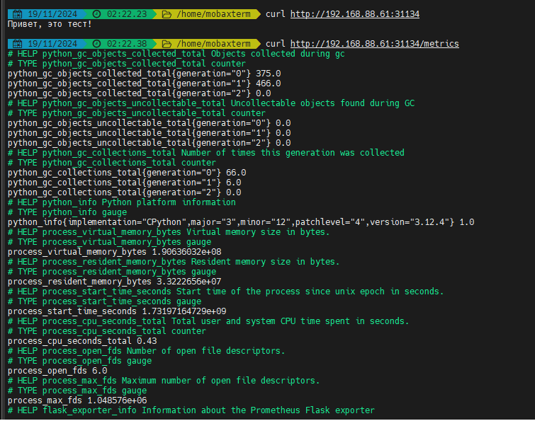

# test app
Разворачивал в локальном гитлабе, для загрузки перенес на гитхаб. Также не стал упаковывать в хелм чарт т.к. это всё же тестовое задание. Пример вывода /metrics приложен в metrics.txt

# Скриншоты

## Деплой через ArgoCD

## Вывод kubectl get deploy -A

## Вывод kubectl get pods -A

## Вывод kubectl get svc -A

## Ответы на / и /metrics

